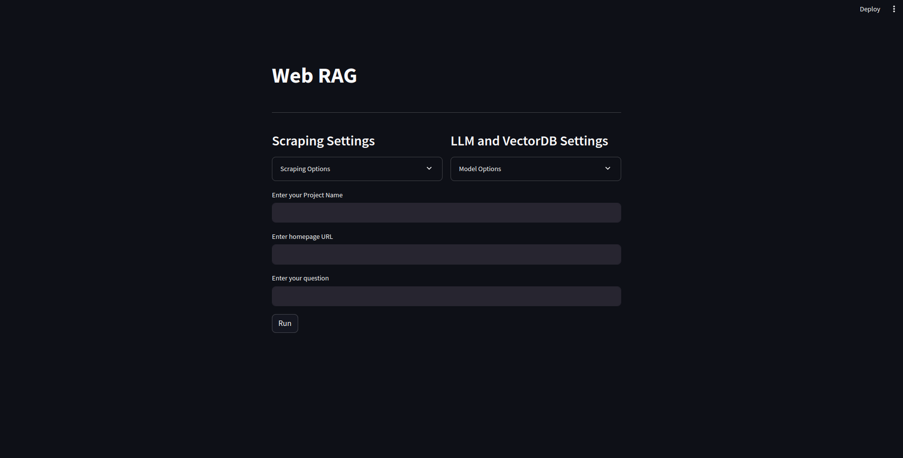
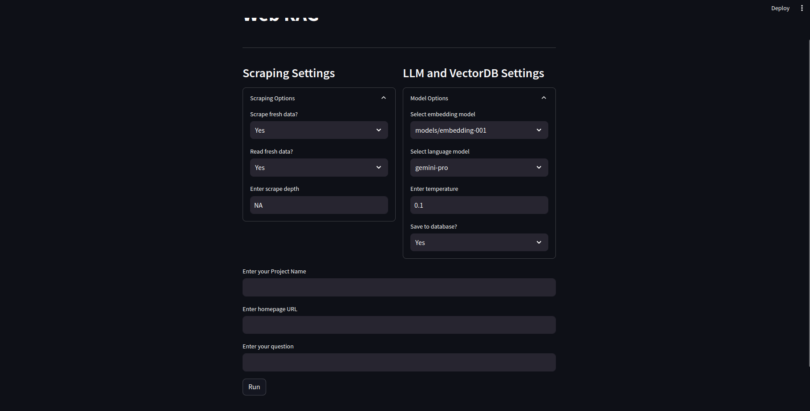
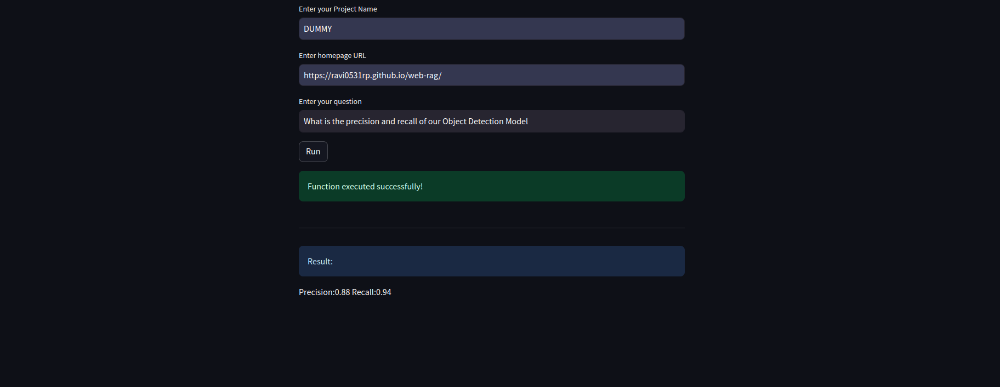

# WEB RAG

## Introduction
* Given a web page's address, our application will try to parse data in that page as well as all the
links available in the page recursively. 
* And then, based off of that data, we will use our LLM based backend to answer queries.
* Hosted [Website](https://ravi0531rp.github.io/web-rag/) using Github IO.

## Elements

* We are using html and css for creating a dummy website. Later, we will try to handle all websites.
* Using requests and beautifulSoup, we scrape the pages contained.
* Using Google Generative AI embeddings & FAISS Vector DB, we are creating a database whenever that 
script is triggered.
* With the help of Gemini Pro which we are using as the backend LLM, we are querying our questions.
* For our frontend, streamlit is being used.

## KEY MILESTONES

- [X] Create a website and host using Github IO.
- [X] Web Scraper with requests and bs4.
- [X] Basic Chat Test
- [X] Create a new script that runs the scraping dynamically and then runs the vector store. 
- [X] Add some criteria for reload or not, whether we want to scrape fresh for vector DB or just chat using current settings.
- [X] Streamlit frontend
- [ ] Add feature for figuring out the source page as well for any query.
- [ ] Scrape Images as well. Keep it optional.
- [ ] Make LLMs and VectoreStores configurable. Dont just stick to a specific one.
- [ ] Generalize it for more websites other than just github IO websites.
- [ ]  Add options for depth control because external pages can contain huge amounts of links.
- [ ] Dockerize the project.
- [ ] More to follow..

<table>
  <tr>
    <td align="center">
      
    </td>
    <td align="center">
      
    </td>
  </tr>
  <tr>
    <td align="center">
      
    </td>
    <td align="center">
      
    </td>
  </tr>
</table>
